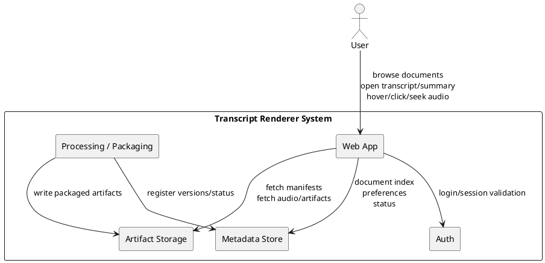
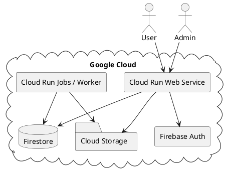
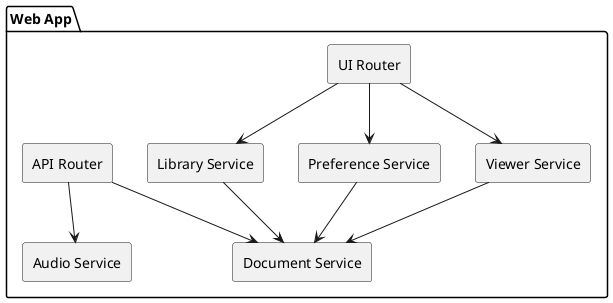
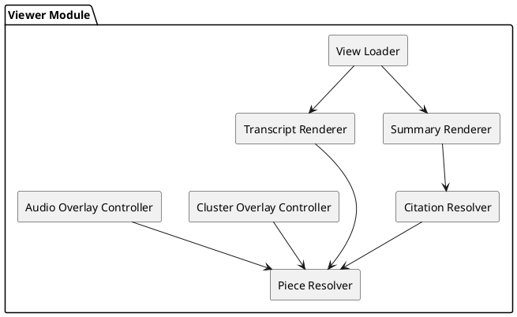
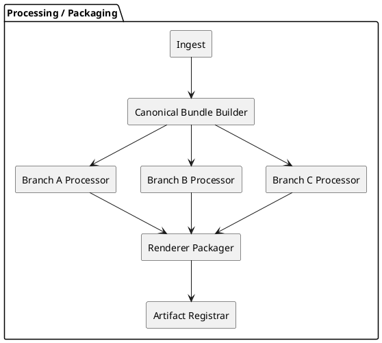
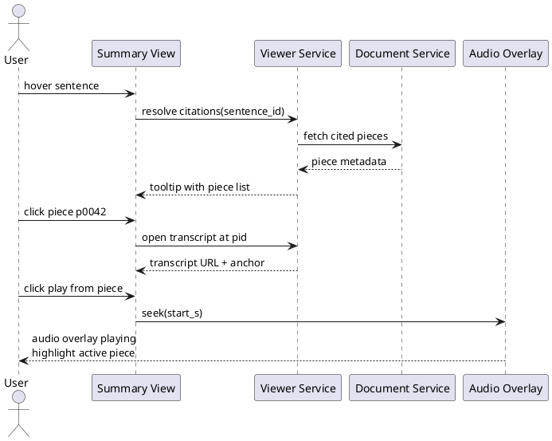

# Congress / Class Transcript Renderer — PoC Infrastructure, Stack, and Minimal Production-Friendly Architecture

## 0. Summary

### Recommendation

**Best overall PoC path:**

- **Infrastructure:** **Google Cloud Run + Cloud Storage + Firestore + Firebase Auth**, with the heavy Branch B / future processing staying in **Cloud Run Jobs** or external workers.
- **Application stack:** **FastAPI + Jinja2 + HTMX**, extending the baseline you already have.
- **Data contract strategy:** treat **canonical pieces** as the single source of truth, and generate **renderer-specific manifests** for Branch A, Branch B, and Branch C instead of making the UI parse markdown or raw intermediate JSON at runtime.

### Why this is the best fit

1. It matches your current direction and existing FastAPI/Cloud Run work, reducing integration risk.
2. It is one of the strongest options for a **free-tier-first PoC** while still preserving a credible path to production.
3. It supports **Git/GitHub-based deployment** cleanly.
4. It minimizes frontend complexity while still enabling the hover/trace/audio UX.
5. It preserves your core architectural principle: **all views are traceable views over the same canonical pieces**.

### Final ranking

**Infrastructure**
- **S**: Google Cloud Run stack
- **A**: Oracle Cloud Always Free VM
- **A-**: Koyeb free web service
- **B**: Render free web service
- **C**: Azure App Service Free
- **C- / D**: Vercel for full backend-hosted renderer
- **D**: AWS Lambda/API Gateway for this specific workload shape
- **D**: Railway free-tier path for this PoC

**Application stack**
- **S**: FastAPI + Jinja2 + HTMX
- **A**: Django + Templates + HTMX
- **A-**: Laravel + Blade + Livewire
- **B+**: Rails + Hotwire
- **B**: Next.js + React + API/backend split
- **C**: Classic LAMP / plain PHP

### Critical architecture decision

Do **not** make the viewer reconstruct traceability from markdown + interleaved cites + raw JSON at runtime.

Instead, add a packaging step that emits explicit render-ready contracts:

- `document_manifest.json`
- `pieces_index.json`
- `branch_a_render.json`
- `branch_c_render.json`
- `clusters_render.json`
- `audio_manifest.json`

That single decision removes a large amount of renderer complexity and makes the hover/click/jump/audio behavior deterministic.

---

## 1. Framing and constraints

### 1.1 What was already true from your current strategy

Your current strategy is still correct at the architectural level: Whisper output is transformed into canonical **pieces**, and Branch A / B / C are different views over that same shared source of truth. That principle is explicit in your strategy document and should remain the foundation of the web renderer. fileciteturn0file1

Your existing FastAPI + Jinja2 + HTMX baseline is also a strong starting point for the PoC because it keeps the API first-class, the UI thin, and deployment simple on Cloud Run. fileciteturn0file0

### 1.2 What changed after reviewing the sample artifacts

The sample data strongly suggests that the renderer should not consume only the human-facing markdown outputs. Instead, it should consume **normalized render manifests** derived from the canonical bundle and branch outputs.

That is because the UI you want requires precise, low-friction operations:

- hover word → resolve piece
- piece → resolve timestamps and audio seek
- summary sentence → resolve cited pieces
- piece → resolve cluster membership
- cluster hover/click → resolve all related pieces across views

Those operations become brittle if the UI has to infer structure from markdown, but become clean if they are backed by explicit contracts.

### 1.3 PoC assumptions used in this report

- User count is initially low.
- Heavy processing is **not** done synchronously inside the web request path unless intentionally forced for testing.
- The PoC prioritizes **time-to-working-demo** over visual polish.
- You want a path that is cheap now, but can be funded and hardened later.

---

## 2. Infrastructure tier list

## 2.1 Tier S — Google Cloud Run stack (Recommended)

### Composition

- **Cloud Run service** for the FastAPI web app
- **Cloud Storage** for audio files and generated artifacts
- **Firestore** for document index, users, preferences, lightweight metadata
- **Firebase Auth** for Google sign-in and email/password
- **Cloud Run Jobs** for heavy asynchronous packaging / processing tasks as needed
- Optional later: Firebase Hosting in front of Cloud Run for static shell/CDN behavior

### Why it ranks first

Cloud Run has one of the strongest free allocations for a PoC: the request-based model includes free monthly vCPU-seconds, GiB-seconds, and requests, and Cloud Run Jobs also have a separate free allocation. Cloud Run services can handle requests up to 60 minutes, while Cloud Run Jobs can run much longer for batch work. citeturn20view5turn5search0turn11search2

For deployment, Google supports source-based deploys and Git-driven continuous deployment via Cloud Build / Developer Connect, which aligns well with your desire for simple GitHub-based iteration. Cloud Build also includes free monthly build minutes. citeturn4view1turn4view2turn4view3turn8view1

For a PoC data layer, Firestore has a meaningful free tier for reads/writes/storage, and Cloud Storage also has always-free allowances in specific US regions. Firebase Auth supports Google sign-in and email/password without forcing you into a full custom auth stack. citeturn10search0turn4view5turn6search0

### Important caveats

- You still need a **billing account** enabled to use Google Cloud free tier products. citeturn10search0
- Cloud Storage always-free storage is region-constrained to specific US regions. citeturn10search0
- **Cloud SQL is not a good free-tier-first choice** here; it no longer behaves like an always-free foundational database and is better deferred until you truly need relational guarantees. citeturn20view6

### Best fit for your project

This is the best balance of:

- low ops burden
- easy PoC deployment
- enough runtime flexibility
- compatibility with your current FastAPI baseline
- straightforward separation between web path and heavy processing path

### Verdict

**Choose this unless the absolute top priority is squeezing the maximum compute out of a true always-free VM and you are willing to accept significantly more ops burden.**

---

## 2.2 Tier A — Oracle Cloud Always Free VM

### Why it ranks second

Oracle Cloud’s Always Free offering is unusually strong in raw compute relative to most other free tiers, especially if you are willing to self-manage a VM. Their always-free VM capacity is materially more generous than most “free web service” offerings. citeturn4view6

### Why it did not rank first

It loses to Cloud Run for **PoC velocity** and operational simplicity:

- you manage the VM, OS, updates, reverse proxy, deployments, process supervision, TLS, backups
- you own uptime/recovery behavior more directly
- architecture discipline becomes more important earlier
- Git push-to-deploy is less native unless you build it yourself

### When to pick it instead

Pick OCI if:

- you want to minimize platform billing risk as hard as possible
- you are comfortable running Docker Compose / systemd / Caddy / Nginx yourself
- you may want heavier always-on Python workloads than Cloud Run free usage comfortably covers

### Verdict

**Best raw compute under an always-free model, but worse than Cloud Run for this specific PoC because the operational tax is higher.**

---

## 2.3 Tier A- — Koyeb Free Web Service

### Why it ranks well

Koyeb is attractive for lightweight Git-based deployment and fast demo iteration. It supports GitHub-based deployment and is friendly for simple containerized apps. citeturn7search2turn7search6turn7search10

### Why it stops at A-

Its free tier is intentionally tight: one free web service per organization, small CPU/RAM, no persistent volumes, scale-to-zero behavior, and restrictions that make it a weaker fit for a multi-part renderer + processing system. citeturn21view3turn20view2

### Verdict

**Good demo platform, not the best system platform for your PoC unless you want the simplest possible public demo and can accept tight limits.**

---

## 2.4 Tier B — Render Free Web Service

### Why it is viable

Render has very good GitHub integration and a pleasant developer experience. It is easy to get a web service online from a repository, including blueprint-style deployment. citeturn7search5turn3search18

### Why it ranks below Koyeb and Google

The free tier has important structural drawbacks:

- free instances spin down after inactivity
- free filesystem is ephemeral
- free Postgres expires after 30 days
- monthly hours are capped around a “demo” level rather than a robust platform level citeturn20view0turn20view1

Those constraints are especially awkward for a document renderer that benefits from stable caches and artifact availability.

### Verdict

**Acceptable for a public demo. Not my preferred base for this PoC because the storage/runtime caveats will surface quickly.**

---

## 2.5 Tier C — Azure App Service Free

Azure App Service Free is simply too constrained here: the free plan is designed for lightweight trials and learning, with tight daily CPU limits. It can host a demo, but it is not a comfortable fit for the renderer + artifact-serving + possible packaging pattern you want. citeturn20view3turn19search10

### Verdict

**Not recommended unless organizational reasons force Azure.**

---

## 2.6 Tier C- / D — Vercel for the full backend application

Vercel is excellent for frontend deployments and preview workflows, but it is a weaker fit for this project as the primary backend host. Function duration and packaging constraints are not ideal for a Python-centered SSR app with processing-adjacent behavior. citeturn4view9turn2search6turn7search7

### Best use of Vercel here

If you ever split the app into:

- static/React frontend on Vercel
- Python API elsewhere

then Vercel becomes more attractive. But that is **not** the fastest route to your PoC.

### Verdict

**Good frontend platform, poor primary platform for this exact PoC.**

---

## 2.7 Tier D — AWS Lambda + API Gateway

AWS can certainly host this in pieces, and Lambda has a free tier, but the shape of the system becomes less natural: hard 15-minute execution max, more moving pieces, and more assembly work for a renderer-centric app that is not best expressed as a pure serverless-function mesh. citeturn20view4turn4view10turn17search1

### Verdict

**Technically viable, strategically inferior for this specific PoC.**

---

## 2.8 Tier D — Railway

Railway is pleasant to use, but its current free path is not strong enough for a strict “free-tier-first” recommendation: it behaves more like an experimentation allowance than a robust always-free deployment base. citeturn23view0turn23view1turn23view2

### Verdict

**Not recommended under your stated free-tier priority.**

---

## 2.9 Infrastructure decision table

| Tier | Option | Best for | Main weakness | Final verdict |
|---|---|---|---|---|
| S | Google Cloud Run + Firestore + GCS + Firebase Auth | Best PoC overall balance | Billing account required; GCS free region constraints | **Recommended** |
| A | OCI Always Free VM | Max always-free compute | More ops, more manual setup | Strong fallback |
| A- | Koyeb | Fast public demo from Git | Tiny free envelope | Good lightweight fallback |
| B | Render | Easy deploy UX | Spin-down, ephemeral disk, expiring free DB | Demo-only fallback |
| C | Azure App Service Free | Azure-only contexts | Too constrained | Not recommended |
| C-/D | Vercel | Frontend-heavy apps | Weak primary backend fit | Not recommended as main platform |
| D | AWS Lambda/API Gateway | Existing AWS-heavy teams | Awkward fit, more assembly | Not recommended |
| D | Railway | Quick experiments | Weak free economics | Not recommended |

---

## 3. Stack tier list

## 3.1 Tier S — FastAPI + Jinja2 + HTMX (Recommended)

### Why it ranks first

FastAPI gives you clean typed contracts, automatic OpenAPI docs, and a highly productive Python developer workflow. HTMX lets you build dynamic UI behavior with server-rendered HTML fragments, which is exactly what this PoC wants: rich enough UX without a frontend SPA tax. citeturn12search0turn12search10turn12search2turn12search6

This is especially aligned with your case because:

- your logic is already Python-heavy
- your current web baseline is already FastAPI-oriented fileciteturn0file0
- the UI is interaction-rich, but not yet a full client-side app that justifies React complexity
- precise contracts matter because the renderer sits on top of multi-branch artifacts

### Why it is better than jumping to React now

Your renderer needs correctness and frictionless traceability more than client-side state sophistication. Most of the complexity is in:

- mapping words/sentences to pieces
- resolving citations and cluster membership
- audio seek/highlight behavior
- storage/auth/doc index contracts

Those are mostly **data contract and interaction model** problems, not “build a SPA” problems.

### Verdict

**Best PoC stack by a clear margin.**

---

## 3.2 Tier A — Django + templates + HTMX

### Why it ranks high

Django is the strongest alternative if you want more built-in batteries out of the box: ORM, admin, auth patterns, migrations, forms, static handling, deploy guidance. citeturn14view0turn14view1turn14view2turn14view3

### Why it does not rank first

You are not starting from “I need an admin-heavy CRUD app.” You are starting from:

- Python processing pipeline already exists
- FastAPI baseline already exists
- explicit API contracts matter
- lightweight UI over artifact views is the first target

Django would be more attractive if the project’s center of gravity shifted toward:

- multi-tenant admin workflows
- more relational domain modeling
- heavier internal operations UI

### Verdict

**Excellent alternative, but not the shortest path from your current state to the PoC.**

---

## 3.3 Tier A- — Laravel + Blade + Livewire

Laravel’s ecosystem is excellent for rapid product building, especially with starter kits, auth scaffolding, and Livewire-style dynamic server-driven UI. citeturn12search3turn12search16turn13search4

### Why it ranks below the Python options

It would require an ecosystem and language shift that brings little value relative to FastAPI for your specific pipeline-integrated renderer.

### Verdict

**Very strong general rapid-app option, but strategically worse than staying in Python here.**

---

## 3.4 Tier B+ — Rails + Hotwire

Rails + Hotwire is one of the best “HTML over the wire” stacks for building interactive apps quickly. It deserves respect here because the renderer interaction model fits that philosophy well. citeturn13search8turn13search0turn13search12turn13search6

### Why it does not rank higher

Same reason as Laravel: it is strong in the abstract, but weaker in your actual context because it forces a stack shift away from your existing Python core.

### Verdict

**Good architecture fit in theory, weaker fit in practice for this project.**

---

## 3.5 Tier B — Next.js + React

Next.js is powerful and mainstream, but for this PoC it adds complexity earlier than it adds value. citeturn13search2turn13search5

### Why it ranks lower

It pushes you toward:

- frontend build tooling
- more explicit client/server state management
- more design pressure around API boundaries early
- more implementation overhead for something that can be achieved server-side first

This would make sense later if:

- the UI becomes a product in its own right
- collaborative/realtime features expand significantly
- a richer visual analytics surface is needed

### Verdict

**Good future option, not the right first PoC stack.**

---

## 3.6 Tier C — Classic LAMP / plain PHP

Classic LAMP is still viable, but it is not the optimal choice for this PoC. It offers fewer structured advantages for the kinds of typed contracts, renderer manifests, and Python-adjacent integration you need.

### Verdict

**Can work, but inferior to the modern server-rendered alternatives above.**

---

## 3.7 Stack decision table

| Tier | Stack | Best for | Why not chosen |
|---|---|---|---|
| S | FastAPI + Jinja2 + HTMX | Fastest path from current baseline to working PoC | — |
| A | Django + Templates + HTMX | Admin-heavy Python app with more batteries | More framework than needed right now |
| A- | Laravel + Blade + Livewire | Rapid product teams in PHP | Ecosystem shift, weaker alignment with existing pipeline |
| B+ | Rails + Hotwire | HTML-over-the-wire productivity | Ecosystem shift |
| B | Next.js + React | Rich frontend productization | Overkill for first PoC |
| C | Classic LAMP | Very simple generic hosting | Worse contracts/dev velocity for this use case |

---

## 4. Final recommendation

## 4.1 Infrastructure

Use:

- **Cloud Run** for the web app
- **Cloud Storage** for artifacts and audio
- **Firestore** for metadata and user-facing document index/search state
- **Firebase Auth** for sign-in
- **Cloud Run Jobs** or external workers for heavy packaging / async processing

Avoid for the PoC:

- Cloud SQL
- Kubernetes/GKE
- microservices split too early
- SPA frontend split too early

## 4.2 Stack

Use:

- **FastAPI** for APIs + server-side rendering
- **Jinja2** for HTML templates
- **HTMX** for partial updates
- Optional **Alpine.js** only for tiny local UI state when HTMX alone becomes awkward

## 4.3 Product slicing recommendation

Implement in this order:

### Phase 1 — Read-only viewer PoC

- Single-user or simple auth
- Directory list of documents
- Branch A transcript viewer
- Branch C summary viewer
- Hover → piece highlight
- Click cited piece → open Branch A at anchor
- Click piece → seek audio and show bottom overlay player
- Optional cluster highlight toggle

### Phase 2 — Personal library and auth

- Google sign-in + email/password
- user-scoped document index
- folders/search
- persisted view preferences

### Phase 3 — Pipeline integration

- upload audio
- create processing job
- processing status page
- callback/webhook/job polling
- generated artifacts registered into manifest index

### Phase 4 — Google Drive sync

- watched folder ingest
- auto-import
- processing + packaging
- generated directory/artifact views

---

## 5. Minimal production-friendly architecture

## 5.1 Architecture principles

1. **Canonical pieces are the SSOT**.
2. **Renderer never reconstructs meaning from markdown if it can be packaged explicitly.**
3. **Branch outputs are view artifacts, not independent truths.**
4. **Processing path and viewing path are separate concerns.**
5. **UI modules talk through explicit contracts, not implicit parsing heuristics.**
6. **Start monolithic in deployment, modular in code/contracts.**

---

## 5.2 High-level modules

1. **Auth Module**
2. **Library Module**
3. **Document Viewer Module**
4. **Audio Playback Module**
5. **Cluster/Trace Overlay Module**
6. **Processing Orchestration Module**
7. **Artifact Packaging Module**
8. **Storage Module**
9. **Metadata/Index Module**

---

## 5.3 High-level contracts

### Contract A — Document Manifest

Purpose: tell the UI what exists for a document.

```json
{
  "doc_id": "doc_abc123",
  "title": "Lecture 04 - Ethics and Action",
  "owner_user_id": "user_001",
  "status": "ready",
  "available_views": ["audio", "transcript", "summary"],
  "artifacts": {
    "pieces_index": "gs://.../pieces_index.json",
    "branch_a_render": "gs://.../branch_a_render.json",
    "branch_c_render": "gs://.../branch_c_render.json",
    "clusters_render": "gs://.../clusters_render.json",
    "audio_manifest": "gs://.../audio_manifest.json"
  },
  "versions": {
    "canonical_bundle": "v1",
    "branch_a": "v3",
    "branch_b": "v5",
    "branch_c": "v2",
    "renderer_pack": "v1"
  }
}
```

### Contract B — Pieces Index

Purpose: canonical lookup for all renderer interactions.

```json
{
  "doc_id": "doc_abc123",
  "pieces": [
    {
      "pid": "p0001",
      "start_s": 12.34,
      "end_s": 18.02,
      "text": "...",
      "cluster_ids": ["c03"]
    }
  ]
}
```

### Contract C — Branch A Render

Purpose: render transcript view deterministically.

```json
{
  "doc_id": "doc_abc123",
  "view": "branch_a",
  "blocks": [
    {"type": "heading", "level": 1, "text": "Introduction", "anchor": "h1_01"},
    {"type": "piece", "pid": "p0001", "anchor": "piece_p0001"},
    {"type": "paragraph_break"},
    {"type": "piece", "pid": "p0002", "anchor": "piece_p0002"}
  ]
}
```

### Contract D — Branch C Render

Purpose: render summary and preserve sentence-level grounding.

```json
{
  "doc_id": "doc_abc123",
  "view": "branch_c",
  "sections": [
    {
      "sid": "summary_exec",
      "title": "Executive Summary",
      "blocks": [
        {
          "block_id": "b01",
          "kind": "paragraph",
          "sentences": [
            {
              "sentence_id": "s01",
              "text": "The speaker argues that moral judgment depends on context.",
              "citations": ["p0042", "p0043", "p0071"]
            }
          ]
        }
      ]
    }
  ]
}
```

### Contract E — Clusters Render

Purpose: power the cluster overlay and topic awareness.

```json
{
  "doc_id": "doc_abc123",
  "clusters": [
    {
      "cluster_id": "c03",
      "title": "Freedom and responsibility",
      "default_color": "amber",
      "piece_ids": ["p0042", "p0043", "p0044"]
    }
  ]
}
```

### Contract F — Audio Manifest

Purpose: drive seek and player overlay.

```json
{
  "doc_id": "doc_abc123",
  "audio": {
    "stream_url": "/media/doc_abc123/audio",
    "duration_s": 4123.2,
    "mime": "audio/mpeg"
  }
}
```

---

## 6. Recursive PlantUML diagrams

## 6.1 System context



## 6.2 Deployment view



## 6.3 Web app internal modules



## 6.4 Viewer module internals



## 6.5 Processing and packaging view



## 6.6 Interaction sequence — summary sentence to audio



---

## 7. Module-by-module design

## 7.1 Auth Module

### Responsibilities

- Sign-in with Google and optionally email/password
- map authenticated principal to internal `user_id`
- protect document/library routes

### Inputs

- Firebase token / session cookie

### Outputs

- authenticated request context

### Contract

```json
{
  "user_id": "user_001",
  "email": "user@example.com",
  "providers": ["google"]
}
```

### Minimal implementation

- Firebase Auth client-side sign-in
- FastAPI middleware / dependency validates session
- store basic user profile in Firestore

---

## 7.2 Library Module

### Responsibilities

- left sidebar folder/doc tree
- search documents
- list recent docs
- create folders later

### Inputs

- authenticated user
- query string / filters

### Outputs

- paginated library entries

### Minimal Firestore shape

```json
{
  "doc_id": "doc_abc123",
  "owner_user_id": "user_001",
  "title": "Lecture 04",
  "folder_path": "/philosophy/course_a",
  "status": "ready",
  "updated_at": "2026-03-06T12:00:00Z",
  "available_views": ["audio", "transcript", "summary"]
}
```

### Notes

For the PoC, search can be simple prefix / token search over normalized title and folder fields. Full-text search can wait.

---

## 7.3 Document Service

### Responsibilities

- resolve document manifest
- resolve artifact URIs/paths
- fetch packaged render artifacts
- enforce access control

### Core API

- `GET /api/docs/{doc_id}/manifest`
- `GET /api/docs/{doc_id}/view/{view_name}`
- `GET /api/docs/{doc_id}/pieces`
- `GET /api/docs/{doc_id}/clusters`
- `GET /api/docs/{doc_id}/audio-manifest`

### Notes

This service is the anti-corruption layer between storage and UI. Templates should not directly know storage layouts.

---

## 7.4 Viewer Module

### Responsibilities

- render transcript and summary
- attach anchors and dataset attributes
- coordinate hover/click behavior

### DOM strategy

Each piece-backed span should carry explicit attributes:

```html
<span
  class="piece-fragment"
  data-pid="p0042"
  data-start-s="1337.42"
  data-end-s="1344.18"
  data-clusters="c03,c11"
  id="piece_p0042"
>
  ...text...
</span>
```

Each summary sentence should also be explicit:

```html
<span
  class="summary-sentence"
  data-sentence-id="s01"
  data-citations="p0042,p0043,p0071"
  id="sentence_s01"
>
  The speaker argues that moral judgment depends on context.
</span>
```

### Why this matters

This lets the client do simple, deterministic interaction logic without parsing the visible text.

---

## 7.5 Audio Module

### Responsibilities

- lazy-open bottom overlay player
- seek to piece start time
- keep current active piece highlighted while audio plays

### Minimal PoC behavior

- HTML5 audio element
- on click of piece → `audio.currentTime = start_s`
- interval or `timeupdate` handler updates current active piece based on piece ranges

### Deferred behavior

- waveform
- transcript auto-scroll refinement
- speaker lane visualization
- true word-level karaoke highlight

Those are later enhancements, not PoC blockers.

---

## 7.6 Cluster Overlay Module

### Responsibilities

- toggle cluster color mode on/off
- show cluster title panel
- hover title → temporary highlight all pieces in cluster
- click title → persist highlight state
- double click title → choose a color from predefined palette

### State model

```json
{
  "hover_enabled": true,
  "tooltips_enabled": true,
  "cluster_colors_enabled": true,
  "pinned_clusters": ["c03", "c11"],
  "cluster_color_overrides": {
    "c03": "teal",
    "c11": "rose"
  }
}
```

### Storage

For PoC:

- in-memory on page or localStorage

Later:

- save per-user per-document preferences in Firestore

---

## 7.7 Processing Orchestration Module

### Responsibilities

- accept upload or external job trigger
- create processing record
- fan out to existing pipeline
- track status
- call packager when all required artifacts are ready

### PoC recommendation

Keep orchestration simple:

- upload creates `processing_job`
- a worker / existing pipeline writes status + artifacts
- when artifacts are complete, `Renderer Packager` runs
- `Document Manifest` is updated to `ready`

### Minimal job record

```json
{
  "job_id": "job_123",
  "doc_id": "doc_abc123",
  "status": "processing",
  "stages": {
    "canonical_bundle": "done",
    "branch_a": "done",
    "branch_b": "done",
    "branch_c": "pending",
    "renderer_pack": "pending"
  }
}
```

---

## 7.8 Renderer Packager Module

### Responsibilities

This is the most important new module.

It transforms branch outputs into render-ready artifacts for the web app.

### Inputs

- canonical bundle (`pieces` with timestamps)
- Branch A output
- Branch B cluster output
- Branch C output
- audio metadata

### Outputs

- `document_manifest.json`
- `pieces_index.json`
- `branch_a_render.json`
- `branch_c_render.json`
- `clusters_render.json`
- `audio_manifest.json`

### Why it is critical

Without this module, the UI becomes coupled to unstable implementation details of each branch output.

With this module, the UI sees one stable contract per concern.

### Design rule

**Packaging is where complexity should be absorbed, not the renderer.**

---

## 8. Proposed codebase structure

```text
app/
├── main.py
├── settings.py
├── auth/
│   ├── firebase.py
│   └── dependencies.py
├── routes/
│   ├── ui.py
│   ├── api_docs.py
│   ├── api_library.py
│   ├── api_viewer.py
│   ├── api_audio.py
│   └── api_jobs.py
├── services/
│   ├── library_service.py
│   ├── document_service.py
│   ├── viewer_service.py
│   ├── audio_service.py
│   ├── preference_service.py
│   ├── job_service.py
│   └── packaging_service.py
├── repositories/
│   ├── firestore_repo.py
│   ├── storage_repo.py
│   └── artifact_repo.py
├── schemas/
│   ├── document_manifest.py
│   ├── pieces_index.py
│   ├── branch_a_render.py
│   ├── branch_c_render.py
│   ├── clusters_render.py
│   ├── audio_manifest.py
│   └── jobs.py
├── templates/
│   ├── base.html
│   ├── app_shell.html
│   ├── doc_view.html
│   ├── partials/
│   │   ├── library_sidebar.html
│   │   ├── top_nav.html
│   │   ├── transcript_view.html
│   │   ├── summary_view.html
│   │   ├── audio_overlay.html
│   │   ├── cluster_panel.html
│   │   └── tooltip.html
└── static/
    ├── app.css
    └── app.js
```

### Notes

This is still a **modular monolith**, which is exactly what you want right now.

Do not split into separate deployable services until forced by scale or team boundaries.

---

## 9. API surface recommendation

## 9.1 UI routes

- `GET /ui` → app shell / last opened doc
- `GET /ui/docs/{doc_id}` → main document viewer
- `GET /ui/docs/{doc_id}/transcript` → transcript partial
- `GET /ui/docs/{doc_id}/summary` → summary partial
- `GET /ui/docs/{doc_id}/clusters-panel` → cluster panel partial
- `GET /ui/library` → sidebar partial

## 9.2 JSON APIs

- `GET /api/docs/{doc_id}/manifest`
- `GET /api/docs/{doc_id}/pieces`
- `GET /api/docs/{doc_id}/branch-a`
- `GET /api/docs/{doc_id}/branch-c`
- `GET /api/docs/{doc_id}/clusters`
- `GET /api/docs/{doc_id}/audio-manifest`
- `POST /api/jobs/upload`
- `GET /api/jobs/{job_id}`
- `PUT /api/preferences/docs/{doc_id}`

## 9.3 Media route

- `GET /media/docs/{doc_id}/audio`

That route can either proxy from Cloud Storage or return a signed URL strategy later.

---

## 10. Storage design

## 10.1 Cloud Storage layout

```text
gs://project-bucket/
├── raw/
│   └── {doc_id}/
│       ├── audio.mp3
│       ├── whisper.json
│       └── raw_transcript.txt
├── canonical/
│   └── {doc_id}/
│       ├── pieces.json
│       └── bundle.json
├── branches/
│   └── {doc_id}/
│       ├── branch_a/
│       ├── branch_b/
│       └── branch_c/
└── render/
    └── {doc_id}/
        ├── document_manifest.json
        ├── pieces_index.json
        ├── branch_a_render.json
        ├── branch_c_render.json
        ├── clusters_render.json
        └── audio_manifest.json
```

## 10.2 Firestore collections

```text
users/{user_id}
users/{user_id}/preferences/{doc_id}
documents/{doc_id}
processing_jobs/{job_id}
folders/{folder_id}   # optional later
```

---

## 11. Security and multi-user boundaries

## 11.1 Minimal PoC security model

- authenticated users only for private documents
- every document carries `owner_user_id`
- all document fetches validate ownership or explicit shared access
- signed or proxied media access

## 11.2 What not to do yet

- complex RBAC
- organization-level workspaces
- per-fragment permissions
- collaborative editing

---

## 12. Observability

## 12.1 Application logs

Log:

- doc open
- view switch
- summary sentence clicked
- audio seek from piece
- cluster pin/unpin
- render manifest load failures

## 12.2 Processing logs

Log:

- packaging success/failure
- artifact versions used
- missing-contract validation failures
- job durations

## 12.3 Metrics worth adding early

- average manifest size
- doc load latency
- transcript view render latency
- audio seek latency
- packaging failure count

---

## 13. Validation and testing plan

## 13.1 Contract tests

Every renderer artifact should be schema-validated.

Examples:

- every `pid` referenced in Branch A exists in `pieces_index`
- every citation in Branch C exists in `pieces_index`
- every cluster piece exists in `pieces_index`
- every view named in `document_manifest` resolves to a valid artifact

## 13.2 UI tests

Minimum:

- open transcript page
- hover piece span → tooltip visible
- click piece → audio opens and seeks
- open summary → click citation → transcript opens at anchor
- enable cluster mode → hover cluster title → pieces highlighted

## 13.3 Packaging tests

- input branch artifacts → expected render manifests
- corrupted citations → packaging fails with explicit error
- missing cluster references → packaging emits warning or fallback behavior

---

## 14. What to defer

These are real features, but they should not be in the first PoC slice:

- waveform visualization
- live word-level karaoke sync
- generalized graph view of topic transitions
- advanced semantic search across transcript internals
- drag-and-drop folder organization with full DnD UX
- collaborative annotations
- full mobile-first responsive polishing

---

## 15. Why the other options were not chosen

## 15.1 Why not start with a VM first

A VM is not wrong. It is just slower to turn into a clean PoC because you start solving infra before validating product interaction. That is the wrong trade unless infra control is itself the experiment.

## 15.2 Why not start with React/Next.js first

Because the core uncertainty is not frontend rendering sophistication. The core uncertainty is whether the **traceability interaction model** is pleasant enough for real users. That can be validated with server-rendered HTML.

## 15.3 Why not use Cloud SQL now

Because your early data model is naturally split into:

- blob artifacts
- metadata/index records
- simple user preferences
- processing status records

Firestore + Cloud Storage is enough for that PoC stage, while Cloud SQL adds schema, cost, and operational questions too early. citeturn20view6turn4view5

---

## 16. Implementation roadmap

## 16.1 Sprint 1 — Packaged read-only viewer

Deliver:

- document manifest format
- pieces index format
- branch A render format
- branch C render format
- transcript + summary views
- audio overlay seek from piece

## 16.2 Sprint 2 — Cluster interactions

Deliver:

- clusters render format
- cluster panel
- hover/pin cluster behavior
- local preference state

## 16.3 Sprint 3 — Auth + library

Deliver:

- Google sign-in
- user-scoped document index
- search bar
- left directory panel

## 16.4 Sprint 4 — Upload and processing status

Deliver:

- upload audio
- create processing job
- job status page
- ready-state registration into library

---

## 17. Final decision

If the goal is **the fastest credible PoC** that still respects your long-term architecture, then the choice is:

### Recommended stack

- **Infra:** Google Cloud Run + Cloud Storage + Firestore + Firebase Auth
- **App:** FastAPI + Jinja2 + HTMX
- **Architecture pattern:** modular monolith + packaged renderer manifests over canonical pieces

### Non-negotiable architectural recommendation

Add a **Renderer Packager** module and make the UI consume **render-ready manifests**, not raw branch markdown plus ad hoc parsing.

That is the highest-ROI decision in this whole proposal.

---

## 18. Appendix — concise contracts list

| Contract | Producer | Consumer | Purpose |
|---|---|---|---|
| `document_manifest.json` | Renderer Packager | Web App | Discover available artifacts/views |
| `pieces_index.json` | Renderer Packager | Viewer, Audio, Clusters | Canonical piece lookup |
| `branch_a_render.json` | Renderer Packager | Transcript View | Deterministic transcript rendering |
| `branch_c_render.json` | Renderer Packager | Summary View | Deterministic grounded summary rendering |
| `clusters_render.json` | Renderer Packager | Cluster Overlay | Topic highlighting and grouping |
| `audio_manifest.json` | Renderer Packager | Audio Module | Seek/play metadata |
| `processing_job` record | Orchestrator | Status UI | Pipeline progress tracking |

---

## 19. Recommended next implementation move

Build **only this** first:

1. `Renderer Packager`
2. transcript view from `branch_a_render.json`
3. summary view from `branch_c_render.json`
4. audio overlay seeking from `pieces_index.json`

That sequence validates the real product value before you spend time on the more decorative or infrastructural layers.

⚠️ Anti-pattern risk detected: over-engineering the viewer around generic markdown parsing and highly dynamic client logic too early. Consider locking the PoC around explicit render manifests and validating the user interaction model before generalizing the renderer.
